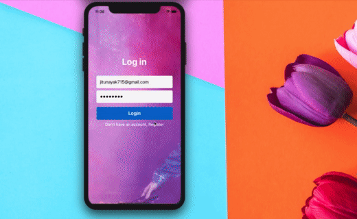
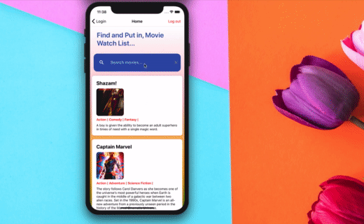

# ⚛︎ Movie Watch List 🎬

### Check individual branch for update of their corresponding progress

 It requires a backend REST API Service which is built over Spring Boot. Which is not a part of this repo.
 
 ### Check list 🧨🔥
 
 - [X] Login Page ✅
 - [X] Registration Page ✅
 - [X] Email service- verification ✅
 - [x] Search Movie Page ✅
 - [x] Logout ✅
 - [ ] Store movies to watch in list❗️
 - [ ] Add a video player❗️
 - [ ] Animations - Shared, Vector ❗️
 - [ ] Deploy services over AWS❗️
 - [ ] Build android/iOS packages❗️
 - [ ] Testing❗️

 ### Added Tab Navigation ⟱
 
 

### Watch the full working video 🚨🚨🚨 - Star 🌟 and fork the project 🤩

